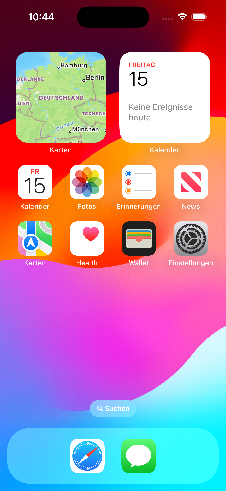

# Name der App

**(Optional) Füge hier einen kurzen, knackigen Slogan ein, um deine App zu bewerben.**

Beschreibe hier in ein paar Sätzen, was deine App bietet.

Für wen ist sie geeignet? Welches Problem löst sie? Was macht deine App anders / besser als andere Apps?
Vermeide es, hier allzusehr in technische Details zu gehen.

## Geplantes Design
Füge hier einige repräsentative Designs deiner App ein (z.B. aus Figma).
Wenn deine App dann so weit ist, dass du echte Screenshots machen kannst, solltest du diese hier einsetzen.

  
  
  

## Features
Hier kommen alle geplanten Features der App rein mit dem Status, ob es bereits umgesetzt wurde.

- [ ] Feature 1
- [ ] Feature 2
- [ ] ...

## Technischer Aufbau

#### Projektaufbau
Eine kurze Beschreibung deiner Ordnerstruktur und Architektur (MVVM, Repositories?) um Außenstehenden zu helfen, sich in deinem Projekt zurecht zu finden.

#### Datenspeicherung
Welche Daten speicherst du? Wo und wie (Firebase, Core Data, etwas anderes)?

#### API Calls
Welche APIs verwendest du?

#### 3rd-Party Frameworks
Verwendest du Frameworks, die nicht von dir stammen? Bspw. Swift Packages für Firebase, fertige SwiftUI-Views o.Ä.? Gib diese hier an.

## Ausblick
Beschreibe hier, wo die Reise nach deinem Praxisprojekt hin geht. Was möchtest du in Zukunft noch ergänzen? Erstelle auch hierzu Issues und verlinke sie, wie oben.
 
