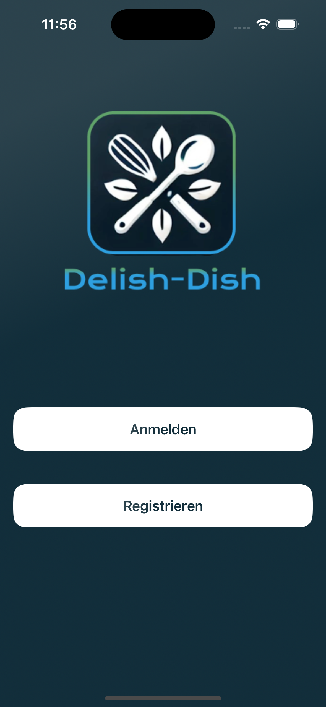
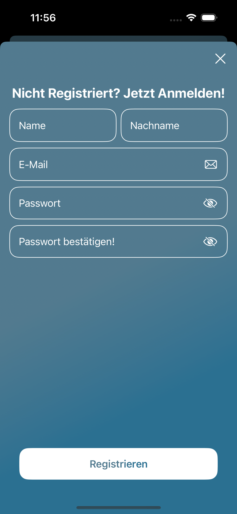
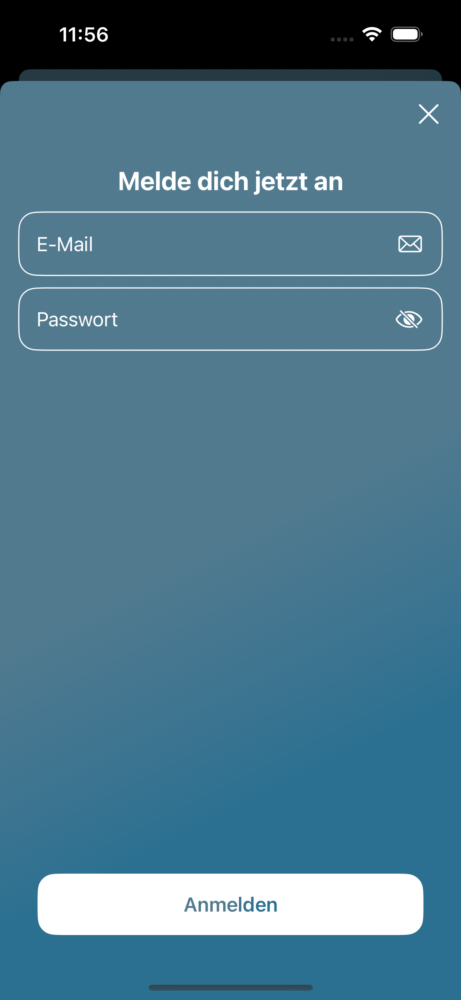
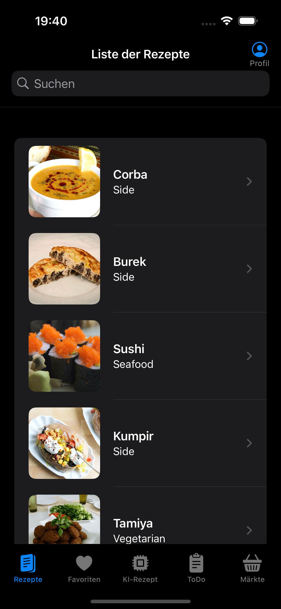
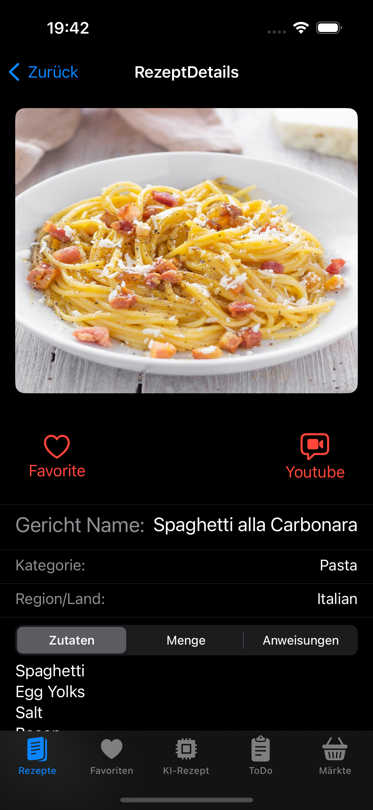
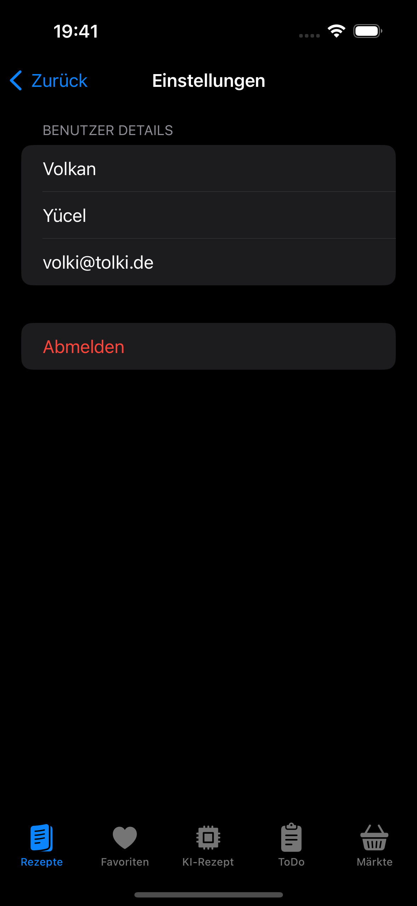
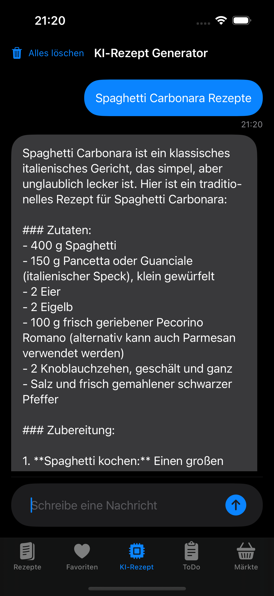
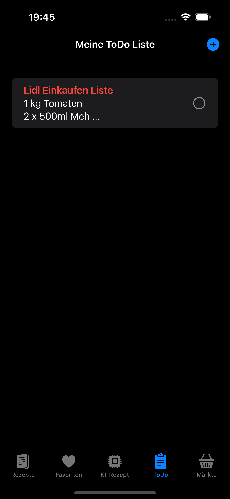
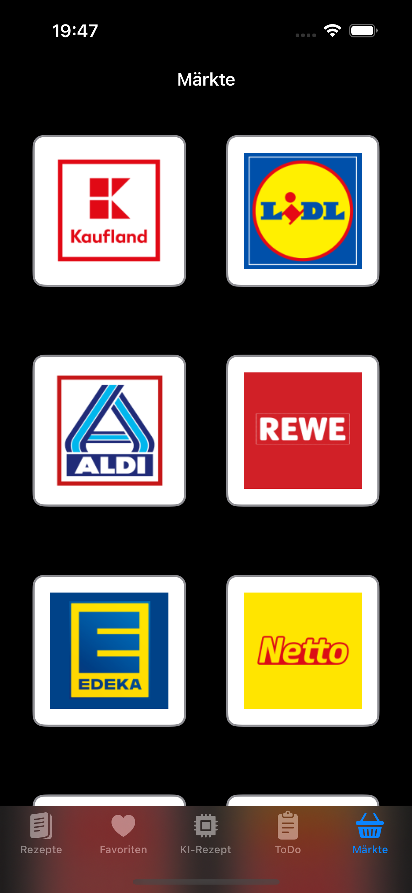
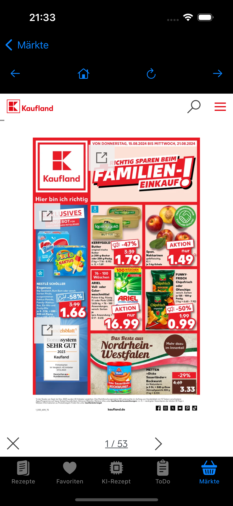

# DelishDish 
  

- ### **Leckere Rezepte und mehr in deiner Hand!**

DelishDish bietet dir leckere Rezepte, mit denen du beeindruckende Gerichte zubereiten kannst, und du kannst diese Rezepte zu deinen Favoriten hinzufügen. Außerdem kannst du eine To-Do-Liste erstellen, um deine Aufgaben zu organisieren. Ideal für alle, die gerne kochen und ihr tägliches Leben organisiert halten möchten. Wenn du bestimmte Rezepte nicht findest oder nach speziellen Rezepten suchst, kannst du sie mit der KI-gestützten Rezeptsuche finden. Die App stellt dir einen KI-Assistenten zur Verfügung. Du kannst die wöchentlichen und täglichen Angebote der Supermärkte verfolgen und deine Einkaufsliste erstellen. Um deine Einkaufsliste zu erstellen, kannst du ToDo verwenden und die Liste, die du erstellt hast, mit den E-Mail-Adressen der registrierten DelishDish-Nutzer teilen.

  
# Die Ansichten der DelishDish-App

- AuthentificationView  
- RegistrierenView
- LoginView

  
  
  

#
- RecipesListView
- RecipesDetailsView
- FavouriteView

  
  
  

#

- ProfileView
- RecipesAIView
- ToDoListView

  
  
  

#

- MarketAngebotenListView
  

  
  

#
  

## Features
Hier kommen alle geplanten Features der App rein mit dem Status, ob es bereits umgesetzt wurde.

- [ ] Benutzer können sich registrieren und anmelden
    
- [ ] Rezeptdaten durchsuchen und Rezepte speichern

- [ ] To-Do-Listen erstellen und verwalten

- [ ] Lieblingsrezepte Favoriten speichern

## Technischer Aufbau

#### Projektaufbau
In meinem Projekt habe ich die MVVM-Architektur verwendet. Die Ordnerstruktur sieht wie folgt 

 - DelishDishApp
 - Models
 - Views
 - ViewModels
 - Services

#### Datenspeicherung
- **Firebase**: Für die Authentifizierung und Speicherung von Benutzerinformationen.

#### Api Calls 
- **[TheMealDB](https://www.themealdb.com/api.php)** :  Zum Abrufen von Rezepten und zum Anzeigen der Zubereitung auf YouTube.
- **[OpenAi-Api](https://platform.openai.com/docs/api-reference/introduction)** : Zum Erstellen eines Rezepte-Generators.

#### 3rd-Party Frameworks
- **Firebase Authentication**: Für Benutzeranmeldung und registrierung.
- **Firebase Cloud Firestore**: Für die Speicherung und Verwaltung der Rezepte und Benutzerinformationen. 

## Ausblick

In Zukunft werde ich noch einige Ergänzungen vornehmen, um mein Projekt weiterzuentwickeln. Aktuell habe ich folgende Pläne:

Eine Liste, die die nächstgelegenen Märkte mit Namen und Adresse anzeigt, um die Zutaten der Rezepte zu beschaffen.
Eine Liste, die die Entfernung dieser Märkte von Ihrem Standort anzeigt.
Eine Funktion, die automatisch Apple Maps startet, um direkt zur ausgewählten Adresse zu navigieren.

